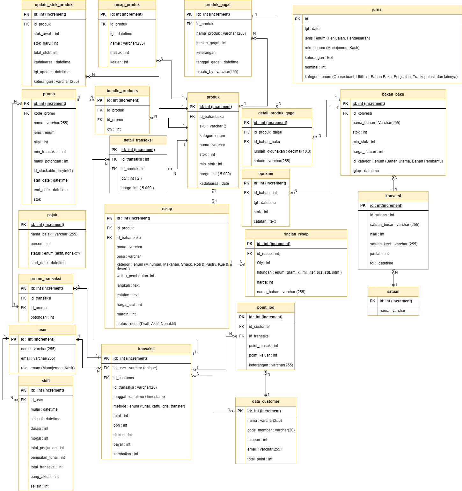

# POS Sanjaya

## Deskripsi Project

POS Sanjaya adalah software yang dirancang untuk mengelola bisnis secara komprehensif, terutama dalam hal pencatatan dan laporan penjualan. Platform ini tidak hanya berfokus pada transaksi kasir, tetapi juga berperan penting dalam pencatatan serta penginputan resource perusahaan seperti bahan baku, produk, dan sebagainya.

## ERD Diagram

Berikut adalah Entity Relationship Diagram (ERD) dari database POS Sanjaya yang menunjukkan struktur dan relasi antar tabel:



### Penjelasan Struktur Database

Database POS Sanjaya dirancang dengan struktur yang komprehensif untuk mendukung operasional bisnis:

#### Tabel Utama:
- **users**: Menyimpan data pengguna sistem (admin, kasir, manager)
- **transaksi & detail_transaksi**: Mencatat seluruh transaksi penjualan dan detailnya
- **produk**: Master data produk jadi yang siap dijual
- **bahan_baku**: Master data bahan baku untuk produksi
- **resep & rincian_resep**: Resep komposisi produk dari bahan baku
- **bundle_products & detail_bundle**: Paket bundling produk
- **opname**: Stock opname untuk kontrol inventori
- **jurnal**: Pencatatan transaksi keuangan
- **customer**: Database pelanggan
- **promo**: Data promosi dan diskon
- **promo_transaksi**: Relasi promo dengan transaksi
- **shift**: Manajemen shift kasir
- **produk_gagal & detail_produk_gagal**: Tracking produk gagal produksi
- **konversi**: Konversi satuan bahan baku
- **update_stok_produk**: History perubahan stok produk
- **satuan**: Master data satuan (kg, pcs, liter, dll)
- **rekap_produk**: Rekap penjualan produk
- **pajak**: Konfigurasi pajak

#### Relasi Kunci:
- **One-to-Many**: Transaksi dengan DetailTransaksi, Resep dengan RincianResep
- **Many-to-Many**: Produk dengan Promo (melalui PromoTransaksi)
- **Foreign Keys**: Setiap tabel detail terhubung dengan tabel master melalui foreign key

### Keunggulan Platform

Berbeda dengan Platform POS pada umumnya yang hanya berfokus untuk memanage kasir, POS Sanjaya dirancang sedemikian rupa untuk menangani dua role sekaligus yaitu:

- **Management**: Mengelola inventori, laporan keuangan, jurnal, rekap produk, dan monitoring bisnis secara keseluruhan
- **Kasir**: Melakukan transaksi penjualan, mengelola shift, dan pencatatan harian

Dengan menggabungkan kedua role dalam satu platform yang terintegrasi, hal ini diharapkan dapat lebih memudahkan dalam pengelolaan bisnis baik untuk kasir maupun management.

### Fitur Utama

- **Manajemen Transaksi**: Pencatatan dan laporan penjualan yang detail
- **Manajemen Inventori**: Kelola bahan baku, produk, satuan, dan konversi
- **Resep & Bundle**: Sistem resep produk dan bundle product
- **Opname Stok**: Monitoring dan update stok produk
- **Jurnal Keuangan**: Pencatatan jurnal dan laporan keuangan
- **Manajemen Customer**: Database pelanggan dan promo
- **Produk Gagal**: Tracking produk yang tidak lolos quality control
- **Shift Management**: Pengelolaan shift kasir
- **Export Data**: Export laporan dalam berbagai format (Excel, PDF)

### Teknologi yang Digunakan

- **Backend**: Laravel 11
- **Frontend**: Livewire, Tailwind CSS, Vite
- **Database**: MySQL/PostgreSQL
- **Export**: Maatwebsite Excel, DomPDF
- **Authentication**: Laravel Fortify & Jetstream

## Instalasi

### Prerequisites

- PHP 8.2 atau lebih tinggi
- Composer
- Node.js & NPM
- MySQL/PostgreSQL

### Langkah Instalasi

1. Clone repository
```bash
git clone https://github.com/training-solonet/pos-sanjaya.git
cd pos-sanjaya
```

2. Install dependencies
```bash
composer install
npm install
```

3. Setup environment
```bash
cp .env.example .env
php artisan key:generate
```

4. Konfigurasi database di file `.env`
```env
DB_CONNECTION=mysql
DB_HOST=127.0.0.1
DB_PORT=3306
DB_DATABASE=pos_sanjaya
DB_USERNAME=root
DB_PASSWORD=
```

5. Jalankan migrasi database
```bash
php artisan migrate
```

6. Build assets
```bash
npm run build
# atau untuk development
npm run dev
```

7. Jalankan aplikasi
```bash
php artisan serve
```

Aplikasi akan berjalan di `http://localhost:8000`

## Development

### Running Development Server
```bash
# Terminal 1 - Laravel
php artisan serve

# Terminal 2 - Vite
npm run dev
```

### Code Quality
```bash
# Fix PHP code style
./vendor/bin/pint

